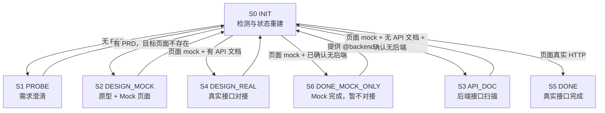

# Frontend Flow：可恢复状态机编排

自动检测当前阶段 → 读取并执行 probe-me / design / api-doc → 门控点等待用户 → 回到 INIT 重新检测 → 直到真实接口对接完成或明确停在 mock-only 终态。

用户只需要记住 `/frontend-flow`。

## 状态机要素

每个状态必须明确：

| 要素 | 说明 |
|------|------|
| Entry | 如何进入此状态 |
| Input | 需要哪些文档/路径/上下文变量 |
| Execute | 读取哪个子 skill，并执行哪段逻辑 |
| Output | 产出或修改哪些文件 |
| Gate | 是否必须等待用户输入 |
| Next | 完成后回到哪里 |
| Fallback | 异常或无法判断时怎么处理 |
| State | 需要维护哪些跨阶段变量 |

### 子 Skill 路径

| Skill | 路径 |
|-------|------|
| frontend-flow | `skills/frontend-flow/SKILL.md` |
| probe-me | `skills/probe-me/SKILL.md` |
| design | `skills/design/SKILL.md` |
| api-doc | `skills/api-doc/SKILL.md` |

---

## S0：INIT — 初始检测

| | |
|---|---|
| **Entry** | 用户执行 `/frontend-flow`，或任一子状态执行完成后回流 |
| **Input** | 用户显式参数、当前工作目录、对话上下文、文件系统现状 |
| **Execute** | 解析输入，重建状态变量，按"检测顺序"命中第一个有效状态 |
| **Output** | 转入 S1 / S2 / S3 / S4 / S5 / S6 |
| **Gate** | 无 |
| **Next** | 命中的状态 |
| **Fallback** | 状态无法唯一判断时，询问具体路径或模块映射 |
| **State** | 可能更新 `prd_path`、`api_path`、`backend_path`、`page_paths` |

### 检测顺序

严格按下面顺序匹配，只进入第一个命中的状态：

```
S1 PROBE           ← PRD 不存在
S2 DESIGN_MOCK     ← PRD 存在，目标页面不存在
S4 DESIGN_REAL     ← 目标页面存在，仍为 mock，且有对应 API 文档
S6 DONE_MOCK_ONLY  ← 目标页面存在，仍为 mock，且用户已确认无后端/暂不对接
S3 API_DOC         ← 目标页面存在，仍为 mock，无对应 API 文档，且未确认无后端
S5 DONE            ← 目标页面存在，且已使用真实 HTTP 调用
```

关键约束：
- S4 必须排在 S3 前面，避免已有 API 文档时仍进入接口扫描。
- S6 必须排在 S3 前面，避免用户已确认无后端时反复扫描。
- 收到 `@backend` 后必须清除 `no_backend_confirmed`，重新进入 S3。
- S5 只表示"真实接口已接入"，不能把 mock-only 误标为完成。

### 输入解析

支持命名参数，不依赖位置：

```
/frontend-flow
/frontend-flow @prd path/to/prd.md
/frontend-flow @prd path/to/prd.md @api path/to/api.md
/frontend-flow @prd path/to/prd.md @api path/to/api.md @backend path/to/backend
/frontend-flow @backend path/to/backend
```

参数优先级：
1. `@prd` 覆盖自动探测到的 prd_path。
2. `@api` 覆盖自动探测到的 api_path；若页面仍为 mock，优先进入 S4。
3. `@backend` 覆盖自动发现的 backend_path；清除 `no_backend_confirmed`；若页面仍为 mock 且无 API 文档，优先进入 S3。

### PRD 探测

探测顺序：
1. 用户显式指定的 `@prd`。
2. `docs/prd/` 下最新或与模块名最匹配的 PRD。
3. 项目根目录中匹配 `*PRD*`、`*prd*`、`*需求*`、`*design*` 的文档。
4. 无法唯一确定时列出候选，让用户选择。

### 目标页面检测

不要用 `src/views/` 或 `src/pages/` 是否存在判断"页面已开发"。必须定位到当前 PRD 对应的目标页面。

```
1. 优先使用上下文中的 page_paths。
2. 如果 page_paths 不存在，尝试重建：
   a. 读取 PRD，提取页面名称、模块名、路由名、英文 key。
   b. 扫描 src/views/*/index.vue、src/pages/*/index.vue。
   c. 结合 docs/design-prototype/*.html 文件名和页面标题做映射。
   d. 若只有一个候选页面，可作为目标页面。
   e. 多个候选且无法确定时，询问用户目标页面路径。
3. 对每个目标页面检查真实文件是否存在。
4. 任一目标页面不存在 → S2。
5. 全部目标页面存在 → 继续判断 S4 / S6 / S3 / S5。
```

### HTTP / Mock 检测

只检测目标页面目录，不扫描整个 `src`。

```
检查范围：
- page_paths 对应的 index.vue
- 同目录 api.js / api.ts
- 同目录 mock.js / mock.ts

真实 HTTP 信号：
- axios
- fetch
- request / httpClient
- .get( / .post( / .put( / .delete( / .request(

Mock 信号：
- mock.js / mock.ts
- 静态数组
- Promise.resolve
- setTimeout 模拟接口
- 本地 fake data
```

判断规则：
- 仅有 mock 信号 → 视为 mock。
- 有真实 HTTP 信号，且页面实际调用真实请求函数 → 视为真实接口。
- mock 和真实 HTTP 同时存在时，读取页面调用链；无法判断则询问用户，不直接进入 S5。

---

## S1：PROBE — 需求澄清

| | |
|---|---|
| **Entry** | INIT 检测到无 PRD |
| **Input** | 用户自然语言描述、用户引用文档、当前项目背景 |
| **Execute** | 读取 `skills/probe-me/SKILL.md`，执行 Phase 1-4 |
| **Output** | `docs/prd/{module}-{timestamp}.md` |
| **Gate** | 需要多轮追问；用户回答前暂停 |
| **Next** | 回到 INIT；正常应命中 S2 |
| **Fallback** | 需求信息仍不足时暂停，提示用户补充目标页面、字段、操作、交互或参考文档 |
| **State** | 记录 `prd_path` |

子 skill 尾语接管：

```
probe-me 原尾语：可以调用 /design
frontend-flow 改写：PRD 已生成：{prd_path}。frontend-flow 已接管，准备进入原型设计阶段。
```

---

## S2：DESIGN_MOCK — 原型与 Mock 页面

| | |
|---|---|
| **Entry** | PRD 存在，但目标页面不存在 |
| **Input** | `prd_path`、`frontend_path` |
| **Execute** | 读取 `skills/design/SKILL.md`，执行"流程 B：新建页面" |
| **Output** | HTML 原型、Vue 页面、api.js、mock.js、必要脚手架 |
| **Gate** | design Phase 5 是硬门控；用户确认原型前不得进入 Vue 生成 |
| **Next** | 回到 INIT；正常应命中 S4 / S6 / S3 |
| **Fallback** | PRD 无法解析页面或模块时，询问用户确认目标页面 |
| **State** | 记录 `frontend_path`、`page_paths` |

执行边界：
- 必须遵守 design 的 Phase 5：原型预览后等待用户回复"可以"或给出修改意见。
- 如果用户反馈原型问题，回到 design 的原型修改阶段，不能跳到 Vue 生成。
- 如果当前目录为空或不是前端项目，遵守 design 的空目录/新项目处理规则。

生成后记录真实输出路径：

```
page_paths = {
  user: "src/views/user-management/index.vue",
  order: "src/views/order/index.vue"
}
```

断点恢复：
- `page_paths` 只保存在对话上下文中，可能丢失。
- 重新执行 `/frontend-flow` 时，INIT 必须按"目标页面检测"规则重建。
- 无法唯一重建时，询问用户目标页面路径。

---

## S3：API_DOC — 后端接口扫描

| | |
|---|---|
| **Entry** | 页面存在，仍为 mock，无对应 API 文档，且未确认无后端 |
| **Input** | `prd_path`、`frontend_path`、`page_paths`、可选 `backend_path` |
| **Execute** | 读取 `skills/api-doc/SKILL.md`，在后端目录执行 Phase 1-4 |
| **Output** | 后端项目中的 `docs/api/{module}-{timestamp}.md`，并复制到前端 `docs/api/` |
| **Gate** | 无法唯一发现后端时，需要用户选择或提供 `@backend` |
| **Next** | 回到 INIT；正常应命中 S4 |
| **Fallback** | 用户明确无后端/暂不对接时，记录 `no_backend_confirmed = true`，回到 INIT；正常应命中 S6 |
| **State** | 记录 `backend_path`、`api_path` 或 `api_paths` |

### 后端发现策略

按优先级执行：
1. 用户显式指定 `@backend path`。
2. 使用上下文中的 `backend_path`。
3. 搜索同级目录：
   ```
   ../backend/pom.xml
   ../*-server/pom.xml
   ../pom.xml
   ../build.gradle
   ../src/main/java
   ```
4. monorepo 深度 2 扫描：
   ```
   ../*/pom.xml
   ../*/build.gradle
   ../*/src/main/java
   ```
5. 多个候选 → 列出候选让用户选择。
6. 没有候选 → 询问用户是否提供 `@backend`，或确认暂不对接真实接口。

### 跨目录执行

```
frontend-flow 外层：
  frontend_path = 前端项目根目录
  backend_path = 后端项目根目录

执行 api-doc 子逻辑时：
  子 skill 视角的 {project_path} = backend_path
  所有扫描命令的 workdir = backend_path

复制接口文档时：
  源文件 = api_path
  目标目录 = frontend_path/docs/api/
```

### 精准复制 API 文档

只复制本轮生成且与当前模块匹配的文件，不使用宽泛通配符：

```bash
mkdir -p {frontend_path}/docs/api
cp {api_path} {frontend_path}/docs/api/{module}-{timestamp}.md
```

多模块时记录映射：

```
api_paths = {
  user: "{backend_path}/docs/api/user-202605261430.md",
  order: "{backend_path}/docs/api/order-202605261432.md"
}
```

子 skill 尾语接管：

```
api-doc 原尾语：请复制到前端项目
frontend-flow 改写：接口文档已就位：{frontend_path}/docs/api/{module}-{timestamp}.md。准备对接真实接口。
```

---

## S4：DESIGN_REAL — 真实接口对接

| | |
|---|---|
| **Entry** | 页面存在，仍为 mock，且前端 `docs/api/` 下有对应模块 API 文档 |
| **Input** | `prd_path`、`api_path` / `api_paths`、`page_paths` |
| **Execute** | 读取 `skills/design/SKILL.md`，执行"流程 D：对接真实接口" |
| **Output** | 更新 `api.js` / `api.ts`、`index.vue`，保留或调整 mock 兜底 |
| **Gate** | 无；构建或验证失败时按 design 验证流程修复 |
| **Next** | 回到 INIT；正常应命中 S5 |
| **Fallback** | API 文档与页面模块不匹配时，询问用户确认映射关系 |
| **State** | 可更新 `api_path`、`page_paths` |

必须显式触发 design 的真实接口模式：

```
/design @prd {prd_path} @api {api_path} 对接真实接口，替换 mock
```

多模块时由 frontend-flow 负责拆分为单模块循环调用 design，不能假设 design 的流程 D 会一次正确处理多个模块，也不能把一个模块的接口文档套到其他页面。

```
for module in page_paths:
  prd = prd_path
  api = api_paths[module]
  page = page_paths[module]
  执行：/design @prd {prd} @api {api} 对接 {module} 真实接口，替换该页面 mock
  验证该模块通过后，再处理下一个模块
```

每个模块对接完成后都回到 INIT 重新检测；如果仍有模块是 mock 且已有 API 文档，继续命中 S4。

---

## S5：DONE — 真实接口完成

| | |
|---|---|
| **Entry** | 目标页面存在，且页面实际使用真实 HTTP 调用 |
| **Input** | `prd_path`、`page_paths`、`api_path` / `api_paths` |
| **Execute** | 输出总结框 |
| **Output** | 流程完成说明 |
| **Gate** | 无 |
| **Next** | 结束；用户可重新 `/frontend-flow` 开始下一轮 |
| **Fallback** | 无 |

总结框必须包含：

```
┌─ frontend-flow ──────────────────────────────────┐
│  ✅ 功能开发流程已完成                           │
│                                                    │
│  PRD:  {prd_path}                                  │
│  页面: {page_paths}                                │
│  接口: 已对接真实 HTTP                              │
│  API 文档: {api_path 或 api_paths}                 │
│  验证: 已执行的验证命令与结果                        │
└────────────────────────────────────────────────────┘
```

---

## S6：DONE_MOCK_ONLY — Mock 完成，暂不对接

| | |
|---|---|
| **Entry** | 目标页面存在，仍为 mock，且用户确认无后端或暂不对接真实接口 |
| **Input** | `prd_path`、`page_paths` |
| **Execute** | 输出总结框，明确标注真实接口未对接 |
| **Output** | Mock 前端完成说明 |
| **Gate** | 无 |
| **Next** | 结束；后续提供 `@backend` 可重新进入 S3 |
| **Fallback** | 无 |
| **State** | 保留 `no_backend_confirmed = true`，直到用户提供 `@backend` |

总结框示例：

```
┌─ frontend-flow ──────────────────────────────────┐
│  Mock 前端开发已完成（真实接口未对接）             │
│                                                    │
│  PRD:  {prd_path}                                  │
│  页面: {page_paths}                                │
│  状态: Mock 数据，暂不对接真实接口                  │
│                                                    │
│  后续如有后端项目，执行：                           │
│  /frontend-flow @backend path/to/backend            │
└────────────────────────────────────────────────────┘
```

收到 `/frontend-flow @backend path/to/backend` 后：
1. 清除 `no_backend_confirmed`。
2. 设置 `backend_path`。
3. 回到 INIT。
4. 若页面仍为 mock 且无 API 文档，进入 S3。

---

## 状态流转图



## 跨阶段状态变量

默认维护在对话上下文中；每次 INIT 都必须用文件系统现状校验，不能只相信上下文变量。

| 变量 | 设置时机 | 用途 | 丢失后的恢复 |
|------|---------|------|--------------|
| `frontend_path` | 首次执行时 | 前端项目根目录 | 当前工作目录或用户指定 |
| `prd_path` | 用户指定或 S1 生成 | 传给 S2/S3/S4 | PRD 探测 |
| `page_paths` | S2 生成页面后 | 精准定位目标页面 | 读取 PRD + 扫描页面目录重建 |
| `backend_path` | 用户指定或 S3 发现 | api-doc 的工作目录 | 后端发现策略 |
| `api_path` | S3 生成或用户指定 | 单模块真实对接 | API 文档探测 |
| `api_paths` | 多模块 S3 生成 | 多模块真实对接 | docs/api/ 按模块匹配 |
| `no_backend_confirmed` | 用户确认无后端/暂不对接 | 进入 S6 | 收到 `@backend` 后清除 |

## 编排原则

### 不修改子 skill

`probe-me`、`design`、`api-doc` 文件保持独立，不做耦合修改。

### frontend-flow 负责接管尾语

子 skill 可能仍输出"请执行 /design""请复制到前端项目"等独立调用提示。frontend-flow 必须在外层追加接管说明，并继续状态流转。

### 必须真实执行，不输出导航提示

frontend-flow 不再输出"下一步：请执行 /design"等导航提示，而是直接读取对应子 skill 的 `SKILL.md` 并按其流程执行。只有在用户必须参与的 Gate 才暂停。
